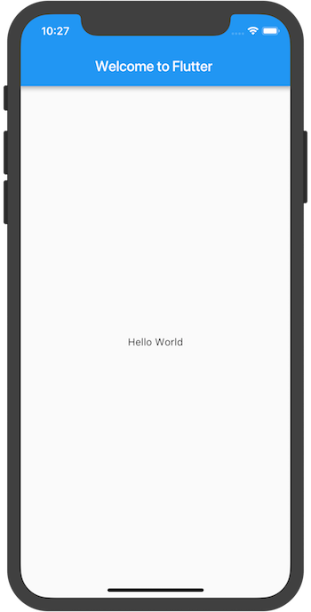
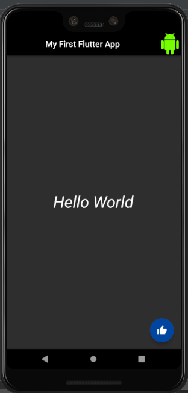
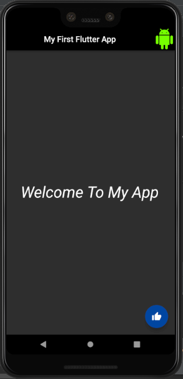

# flutter_helloworld_darktheme

- The Basic Hello World Program in Flutter <br/>
```
import 'package:flutter/material.dart';

void main() => runApp(MyApp());

class MyApp extends StatelessWidget {
  @override
  Widget build(BuildContext context) {
    return MaterialApp(
      title: 'Welcome to Flutter',
      home: Scaffold(
        appBar: AppBar(
          title: Text('Welcome to Flutter'),
        ),
        body: Center(
          child: Text('Hello World'),
        ),
      ),
    );
  }
}
```
<b>Output : </b><br/>

<br/>
- These was the Basic Helloworld Program but i have just modified Helloworld App in Dark Theme and also Add Some Widget,Button,Android Icon.

## Some Screenshot Of the App Before and After Pressing Button

 &nbsp;&nbsp;  <br/>

## Getting Started

This project is a starting point for a Flutter application.

A few resources to get you started if this is your first Flutter project:

- [Lab: Write your first Flutter app](https://flutter.io/docs/get-started/codelab)
- [Cookbook: Useful Flutter samples](https://flutter.io/docs/cookbook)

For help getting started with Flutter, view our 
[online documentation](https://flutter.io/docs), which offers tutorials, 
samples, guidance on mobile development, and a full API reference.
